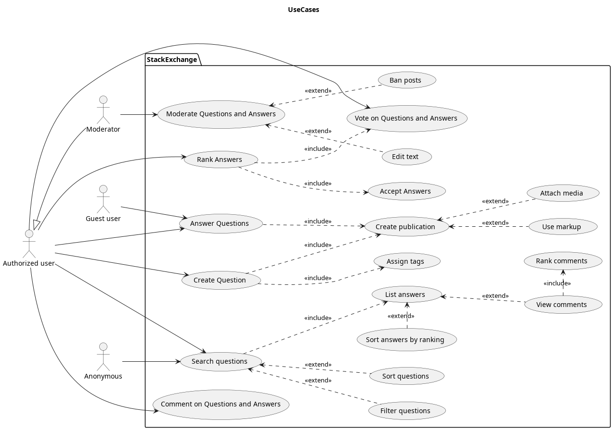

    <h3>Университет ИТМО</h3>
    <h4>Факультет программной инженерии и компьютерной техники</h4>

      

    <h3>Лабораторная работа №1</h3>
    <h4>по дисциплине</h4>
    <h4>"Основы программной инженерии"</h4>
    <h4>Вариант №32191</h4>

    

<h4>Выполнили:</h4>

студенты группы P3219

Бардин Петр Алексеевич

Зайцев Артём Михайлович

 
<h4>Преподаватель:</h4>

Наумова Надежда Александровна

    

    <h5>Санкт-Петербург</h5>
    <h5>2024</h5>

# Задание

> [stackexchange.com](https://stackexchange.com/): Stack Exchange Q&A communities are different.

- Составить список требований, предъявляемых к разрабатываемому веб-сайту (в соответствии с вариантом). Требования
  должны делиться на следующие категории:

    - Функциональные.
        - Требования пользователей сайта.
        - Требования владельцев сайта.
    - Нефункциональные.

- Требования необходимо оформить в соответствии с шаблонами RUP (документ SRS - Software Requirements Specification).
- Для каждого из требований нужно указать его атрибуты (в соответствии с методологией RUP)
- Оценить и аргументировать приблизительное количество часов, требующихся на реализацию этого требования.
- Для функциональных требований нужно составить UML UseCase-диаграммы, описывающие реализующие их прецеденты
  использования.

# Вывод

ВЫВОД
Мы уверены, что полученные знания помогут нам в планировании требований для захвата Монголии.

    
    
    
  

# Software Requirements Specification

<!-- TOC -->
* [Задание](#задание)
* [Вывод](#вывод)
* [Software Requirements Specification](#software-requirements-specification)
  * [Introduction](#introduction)
    * [Purpose](#purpose)
    * [Scope](#scope)
    * [Definitions, Acronyms and Abbreviations](#definitions-acronyms-and-abbreviations)
    * [References](#references)
    * [Overview](#overview)
  * [Overall Description](#overall-description)
    * [Product functions](#product-functions)
    * [User characteristics](#user-characteristics)
    * [Assumptions and dependencies](#assumptions-and-dependencies)
    * [Constraints](#constraints)
  * [Specific Requirements](#specific-requirements)
    * [Functionality](#functionality)
      * [ID: FR1 - Поисковики должны находить нашу систему в интернете.](#id-fr1---поисковики-должны-находить-нашу-систему-в-интернете)
      * [ID: FR2 - Регистрация с помощью сторонних сервисов](#id-fr2---регистрация-с-помощью-сторонних-сервисов)
      * [ID: FR3 - Создание и редактирование вопросов](#id-fr3---создание-и-редактирование-вопросов)
      * [ID: FR4 - Создание и редактирование ответов](#id-fr4---создание-и-редактирование-ответов)
      * [ID: FR5 - Рейтинговая система](#id-fr5---рейтинговая-система)
      * [ID: FR6 - Поиск похожих вопросов.](#id-fr6---поиск-похожих-вопросов)
      * [ID: FR7 - Создание организации](#id-fr7---создание-организации)
      * [ID: FR8 - Система репутации пользователей](#id-fr8---система-репутации-пользователей)
      * [ID: FR9 - Улучшение постов](#id-fr9---улучшение-постов)
      * [ID: FR10 - Система вознаграждений](#id-fr10---система-вознаграждений)
      * [ID: FR11 - Поиск по вопросам](#id-fr11---поиск-по-вопросам)
      * [ID: FR12 - Поиск по критериям](#id-fr12---поиск-по-критериям)
      * [ID: FR13 - Поиск вопроса по тегам](#id-fr13---поиск-вопроса-по-тегам)
      * [ID: FR14 - Модерация контента](#id-fr14---модерация-контента)
      * [ID: FR15 - Система жалоб](#id-fr15---система-жалоб)
    * [Security](#security)
      * [ID: SEC1 - безопасность передачи данных](#id-sec1---безопасность-передачи-данных)
      * [ID: SEC2 - безопасное хранение ПД пользователей](#id-sec2---безопасное-хранение-пд-пользователей)
      * [ID: SEC3 - безопасность аккаунтов пользователей](#id-sec3---безопасность-аккаунтов-пользователей)
      * [ID: SEC4 - разграничение прав пользователей](#id-sec4---разграничение-прав-пользователей)
    * [Usability](#usability)
      * [ID: QR1 - удобство выбора подсистемы](#id-qr1---удобство-выбора-подсистемы)
      * [ID: QR2 - удобство поиска вопроса](#id-qr2---удобство-поиска-вопроса)
      * [ID: QR3 - удобство поиска вопроса - неизвестная тема](#id-qr3---удобство-поиска-вопроса---неизвестная-тема)
      * [ID: QR4 - удобство восприятия ответов вопроса](#id-qr4---удобство-восприятия-ответов-вопроса)
      * [ID: QR5 - ТОП в поисковике](#id-qr5---топ-в-поисковике)
    * [Reliability](#reliability)
      * [ID: REL1 - доступность системы](#id-rel1---доступность-системы)
      * [ID: REL2 - среднее время разрешения сбоя](#id-rel2---среднее-время-разрешения-сбоя)
    * [Performance](#performance)
      * [ID: PERF1 - производительность веб сервера](#id-perf1---производительность-веб-сервера)
      * [ID: PERF2 - количество уникальных пользователей](#id-perf2---количество-уникальных-пользователей)
      * [ID: PERF3 - время доступа - загрузка страницы в среднем](#id-perf3---время-доступа---загрузка-страницы-в-среднем)
      * [ID: PERF4 - пропускная способность канала связи](#id-perf4---пропускная-способность-канала-связи)
      * [ID: PERF5 - дисковое пространство системы хранения](#id-perf5---дисковое-пространство-системы-хранения)
      * [ID: PERF6 - оперативная память вычислительного кластера](#id-perf6---оперативная-память-вычислительного-кластера)
    * [Design Constraints](#design-constraints)
      * [ID: DC1 - используемые технологии разработки ядра](#id-dc1---используемые-технологии-разработки-ядра)
      * [ID: DC2 - используемые инструменты разработки ПО](#id-dc2---используемые-инструменты-разработки-по)
      * [ID: DC3 - организация инфраструктуры полнотекстового поиска и индексирования базы вопросов](#id-dc3---организация-инфраструктуры-полнотекстового-поиска-и-индексирования-базы-вопросов)
    * [Supportability constraints](#supportability-constraints)
      * [ID: SUPP1 - Общий code style для C#](#id-supp1---общий-code-style-для-c)
      * [ID: SUPP2 - Наличие автоматических тестов и CI/CD.](#id-supp2---наличие-автоматических-тестов-и-cicd)
      * [ID: SUPP3 - внесение изменений программный код рабочей системы](#id-supp3---внесение-изменений-программный-код-рабочей-системы)
    * [Interfaces](#interfaces)
      * [User Interfaces](#user-interfaces)
      * [Hardware Interfaces](#hardware-interfaces)
      * [Software Interfaces](#software-interfaces)
      * [Communications Interfaces](#communications-interfaces)
    * [Licensing Requirements](#licensing-requirements)
<!-- TOC -->

    
    
    
  

## Introduction

В этом разделе дается описание объема и обзор всего, что включено в этот документ SRS. Также,
Описана цель данного документа и приведен список сокращений и определений.

### Purpose

Цель данной Software Requirements Specification – описание системы:
формулирование функциональных и нефункциональных требований, описание прецедентов, выделение актеров. Система –
веб-приложение,
которое позволяет задавать и отвечать на вопросы.

### Scope

Данный документ будет использоваться при разработке, тестировании, планировании расходов и времени создания продукта.
Разработчики смогут определить
требования к реализуемому продукту и правильно определить архитектуру, а заказчик сможет проверить корректность
выполнения работ.

### Definitions, Acronyms and Abbreviations

| сокращение | расшифровка              |
|------------|--------------------------|
| ID         | уникальный идентификатор |
| TITLE      | заголовок                |
| DESC       | описание                 |
| RAT        | обоснование              |
| DEP        | зависимость от чего-то   |
| FR         | функционально требование |

### References

Основной ресурс StackExchange, использованный при создании документа: https://stackexchange.com/

### Overview

Далее в данном документе будут отражены основные требования к системе, ее особенностям и функциональным и
нефункциональным требованиям.

  

## Overall Description

В этом разделе будет представлен обзор всей системы. Система будет рассмотрена в ее контексте, чтобы
показать ее основные функциональные возможности. Также будут представлены заинтересованные стороны, функции доступны для
каждого типа пользователей.

### Product functions

Система - группа веб-сайтов для работы с вопросами и ответами в различных областях, где каждый сайт выделен под
собственную область вопросов.
Значительный упор в системе сделан рейтинг пользователей и ответов.

### User characteristics

Пользователи данной системы - люди, у которых есть вопросы по данной тематике. Также пользователями являются специалисты
в своей области, которые готовы ответить на вопросы других пользователей. Более того пользователями являются люди,
которые ищут ответы на вопросы, уже заданные другими пользователями.

[Опишите группы пользователей разрабатываемой системы, как именно они будут взаимодействовать с ней.]

### Assumptions and dependencies

Система зависит от актуальной версии основных браузеров: Google Chrome, Firefox, Yandex browser.

### Constraints

Система ограничена законом от 27 июля 2006 года N 149-ФЗ "Об информации, информационных технологиях и о защите
информации"

## Specific Requirements

[Данный раздел содержит описание всех требований к разрабатываемой системе. Данное описание будет использоваться как разработчиками при разработке системы, так и тестировщиками в процессе проверки её функциональности.]

### Functionality

Данный раздел содержит описание функциональных требований к системе.

#### ID: FR1 - Поисковики должны находить нашу систему в интернете.

**DESC:** Ссылки на нашу систему должны быть в топе для поисковиков.

**RAT:** Благодаря этой функции новые пользователи смогут узнавать о нашей системе 

#### ID: FR2 - Регистрация с помощью сторонних сервисов

**DESC:** Система должна предоставлять пользователям возможность регистрироваться, используя свои учетные записи
из других сервисов таких как Google.

**RAT:** Упростить процесс регистрации и побудить больше пользователей регистрироваться.

#### ID: FR3 - Создание и редактирование вопросов

**DESC:** Система должна позволять пользователям создавать, редактировать и помечать тегами свои вопросы.

**RAT:** Это позволит создать надежную и разнообразную базу вопросов и позволить пользователям эффективно классифицировать свои
вопросы.

#### ID: FR4 - Создание и редактирование ответов

**DESC:** Система должна позволять пользователям создавать и редактировать свои ответы на вопросы.

**RAT:** Смысл этого требования заключается в предоставлении пользователям возможности уточнять свои ответы для ясности и точности.

#### ID: FR5 - Рейтинговая система

**DESC:** В системе должен быть реализован механизм оценки, при котором пользователи могут голосовать (+1 или -1) за
качество ответа.

**RAT:** Поощрять высококачественные ответы и обеспечивать меру согласия или несогласия сообщества с данным ответом.

#### ID: FR6 - Поиск похожих вопросов.

**DESC:** Система должна отображать вопросы, аналогичные тем, которые просматривает или создает пользователь.

**RAT:** Для предотвращения избыточности и предоставления пользователям быстрого доступа к потенциально важной
информации.

#### ID: FR7 - Создание организации

**DESC:** Система должна позволять пользователям создавать организации в рамках платформы.

**RAT:** Для поддержки формирования подсообществ на основе общих интересов или целей.

#### ID: FR8 - Система репутации пользователей

**DESC:** Система должна иметь механизм контроля репутации пользователей, основанной на их вкладе в развитие сообщества.

**RAT:** Система с рейтингом внесёт соревновательный характер в нашу систему. Это, в свою очередь, будет мотивировать
пользователей формулировать ответ, полностью покрывающий все аспекты вопроса.

#### ID: FR9 - Улучшение постов

**DESC:** Система должна позволять участникам сообщества вносить корректировки и улучшения в свои собственные сообщения,
а также предлагать их в сообщения других пользователей

**RAT:** Обеспечить пользователям возможность улучшать качество материала

#### ID: FR10 - Система вознаграждений

**DESC:** Пользователи должны получать вознаграждения в виде значков за выполнение заданий (опубликовать первый вопрос и тд)

**RAT:** Мотивировать пользователей принимать активное участие в развитие базы вопросов и системы в целом

#### ID: FR11 - Поиск по вопросам

**DESC:** Система должна предоставлять пользователям возможность поиска вопроса по его содержанию, 
а также по содержанию ответов на него и комментариев к нему.

**RAT:** Обеспечить скорость выполнения основной задачи сервиса

#### ID: FR12 - Поиск по критериям

**DESC:** Система поиска должна позволять фильтровать и сортировать вопросы по подмножеству критериев: 
теги, дата публикации, репутация пользователя и рейтинг сообщения

**RAT:** Обеспечить эффективность нахождения пользователем релевантной информации в базе вопросов

#### ID: FR13 - Поиск вопроса по тегам

**DESC:** Пользователь должен иметь возможность просмотреть все вопросы по заданному тегу

**RAT:** Через поиск по тегам реализуется группировка вопросов по подтемам, что позволяет, например, легче отвечать
на вопросы, так как отвечающий пользователь может иметь конкретную область специализации.

#### ID: FR14 - Модерация контента

**DESC:** Система должна иметь функционал модерации вопросов, ответов и комментариев с возможностью внесения
корректировок и запрета публикации.

**RAT:** Поддерживать безопасную и уважительную среду сообщества, гарантируя, что весь контент соответствует
стандартам сообщества.

#### ID: FR15 - Система жалоб

**DESC:** Система должна включать механизм подачи жалоб, позволяющий пользователям сообщать о неподобающем контенте или
поведении.

**RAT:** Поддерживать стандарты сообщества и создавать безопасную среду для пользователей.

### Security

#### ID: SEC1 - безопасность передачи данных

**DESC:** при взаимодействии с сервисом извне, все коммуникации должны происходить по защищенному протоколу,
не позволяющему раскрыть персональные данные пользователя.

**RAT:** персональные данные пользователей считаются ценностью системы, их потеря приведет к финансовым и репутационным
потерям

#### ID: SEC2 - безопасное хранение ПД пользователей

**DESC:** ПД пользователей хранятся в БД в минимально требуемом объеме, также применяется хеширование паролей

**RAT:** в результате взлома системы хранения потерянные данные эффект от взлома на пользователей должен быть минимален

#### ID: SEC3 - безопасность аккаунтов пользователей

**DESC:** система аутентификации пользователей должна противодействовать основным способам несанкционированного доступа
к аккаунтам пользователей, таким как атаки перебором паролей.

**RAT:** пользователи не должны иметь возможности получить доступ к аккаунтам им не принадлежащим кроме случаев,
когда система не может напрямую противодействовать этому (утеря логин-пароля)

#### ID: SEC4 - разграничение прав пользователей

**DESC:** система должна обеспечивать соответствие возможностей на площадке ролям пользователей,
а также обеспечивать контроль за владением контентом.

**RAT:** пользователи не должны иметь возможности непредусмотренным требованиям образом изменять состояние системы
и контент на площадке не принадлежащий им.

### Usability

#### ID: QR1 - удобство выбора подсистемы

**DESC:** направления деятельности подсайтов должны быть очевидны пользователю

**RAT:** чтобы пользователь мог перейти на подсайт максимально точно соответствующий предполагаемому вопросу

**DEP:** -

#### ID: QR2 - удобство поиска вопроса

**DESC:** строка поиска вопроса должна быть доступна пользователю на всех основных страницах на видном месте

**RAT:** пользователь не должен тратить время на переходы и дополнительные действия при совершении поиска

#### ID: QR3 - удобство поиска вопроса - неизвестная тема

**DESC:** на корневом сайте должна быть строка поиска по всем сайтам

**RAT:** пользователь должен иметь возможность найти вопрос без траты времени на поиск подходящего подсайта

**DEP:** QR2

#### ID: QR4 - удобство восприятия ответов вопроса

**DESC:** на странице вопроса ответы должны находиться в порядке рейтинга и иметь обозначение ответа выбранного
пользователем, задавшим вопрос

**RAT:** пользователь должен легко определять ценность представляемых ответов

**DEP:** -

#### ID: QR5 - ТОП в поисковике

**DESC:** наша система должна быть одной из первых ссылок при поиске вопросов соответствующих тематик.

**RAT:** Это позволит пользователям чаще пользоваться нашей системой.
Что, в свою очередь, позволит увеличить количество пользователей, задающих вопросы и публикующих ответы.
Это напрямую влияет на развитие системы.

**MUST:** < 6 места

**SHOULD:** < 4 места

**COULD:** < 1 место

### Reliability

#### ID: REL1 - доступность системы

**DESC:** доступность системы должна быть более 99.99%

**RAT:** пользователи не должны испытывать проблемы с поиском ответов на вопросы из-за недоступности сайта

#### ID: REL2 - среднее время разрешения сбоя

**DESC:** MTTR при исправлении аппаратных проблем затрагивающих только производительность системы - до 24 часов,
для проблем препятствующих работе системы - до 1 часа.

### Performance

#### ID: PERF1 - производительность веб сервера

**DESC:** сервер должен обеспечивать постоянную нагрузку в 300 запросов/сек и пиковую до 500 запросов/сек.

**RAT:** пользователи не должны ощущать замедление работы сервиса при пиковой загрузке

#### ID: PERF2 - количество уникальных пользователей

**DESC:** количество уникальных пользователей сервиса до 60млн,
что должно быть отражено способности обрабатывать сессии разных пользователей и вести их личные кабинеты.

**RAT:** система должна поддерживать постоянный уровень качества сервиса при большой нагрузке

#### ID: PERF3 - время доступа - загрузка страницы в среднем

**RAT:** пользователь не должен испытывать задержек при переходах более определенного времени

**MUST:** < 50ms

**SHOULD:** < 25ms

**COULD:** < 15ms

#### ID: PERF4 - пропускная способность канала связи

**DESC:** канал связи должен обеспечивать суммарно прием и передачу данных со скоростью до 100ГБ/час и иметь месячную
емкость в 60ТБ.

**RAT:** для соответствия ограничений канала требуемым объемам запросов веб-страниц за промежуток времени

**DEP:** PERF1

#### ID: PERF5 - дисковое пространство системы хранения

**DESC:** организация двух систем хранения с применением RAID10 на SSD дисках 24 штук по 200ГБ и 24 штук по 1.2ТБ,
с суммарной доступной емкостью кластера в 17ТБ.

#### ID: PERF6 - оперативная память вычислительного кластера

**DESC:** 96ГБ ОЗУ для кластера веб-серверов, 2.5ТБ ОЗУ для кластера баз данных и системы поиска

### Design Constraints

#### ID: DC1 - используемые технологии разработки ядра

**DESC:** Ядро написано с помощью стека WISC

* W = Windows
* I = Internet Information Services (IIS)
* S = SQL Server
* C = C#

#### ID: DC2 - используемые инструменты разработки ПО

**DESC:** Программное обеспечение написано с помощью следующих иструментов

* **IDE** Visual Studio 2019
* **Framework** Microsoft .NET 6.0
* **Web Framework** ASP.NET Core 6.0 with MiniProfiler
* **View Engine** Razor
* **Browser Framework** jQuery 1.12.4
* **Data Access Layer** Entity Framework Core 2.2 and Dapper
* **Cache / Additional Data** redis 4.0.7 via StackExchange.Redis
* **Source Control** Git using a GitHub Enterprise instance
* **Compare Tool** Beyond Compare 4

#### ID: DC3 - организация инфраструктуры полнотекстового поиска и индексирования базы вопросов

**DESC:** использование кластера Elasticsearch

**RAT:** пользователь должен иметь возможность искать ответы используя нечеткие текстовые запросы

### Supportability constraints

#### ID: SUPP1 - Общий code style для C#

**DESC:** Исходный код на C# должен соответствовать соглашению компании Microsoft

**RAT:** Это повысит читаемость всего кода, тк он будет в одном стиле.

#### ID: SUPP2 - Наличие автоматических тестов и CI/CD.

**DESC:** При развёртывании системы должны автоматически запускаться тесты,
которые позволят сразу же обнаружить некоторые ошибки.

#### ID: SUPP3 - внесение изменений программный код рабочей системы

**DESC:** возможность обновить ПО веб-сервера без прекращения предоставления сервиса пользователям,
достигаемая за счет организации кластеров или дублирования и горизонтального масштабирования для каждого типа сервисов.

**RAT:** пользователи не должны испытывать неудобств при проведении плановых и внеплановых работ
на инфраструктуре системы

### Interfaces

#### User Interfaces

При открытии сайта сверху пользователь видит строку ~~пёсика~~ поиска.
Рядом со строкой поиска пользователь может увидеть кнопку входа в аккаунт.
Пользователь может войти в систему с помощью логина и пароля или через сторонние сервисы.
На основной части экрана будут распложаться вопросы, которые система выдала под запрос или
общая информация и системе.

Когда пользователь открывает конкретный вопрос. Сверху он видит сам текст вопроса со всеми
прикреплёнными изображениями. Под ним располагаются ответы других пользователей.
Под каждым из ответов авторизованный пользователь может оставить свой комментарий,
кликнув по соответствующей кнопке.
Так же на странице вопроса авторизованный пользователь может оставить свой ответ.

На странице своего аккаунта пользователь видит свой рейтинг, количество собственных
вопросов и ответов.

#### Hardware Interfaces

Так наша система не зависит от конкретного аппаратного обеспечения,
то у нас в ней не будет аппаратных интерфейсов (Hardware Interfaces).
Отсутствие зависимости от конкретного оборудования обозначает возможность
использования любого аппаратного обеспечения, удовлетворяющее требованиям.
В том числе и виртуальных. Например, Docker.

#### Software Interfaces

Внешние HTTP запросы обрабатываются балансировщиком нагрузки, распределяются по кластеру из веб серверов.
Веб сервер получает и записывает контент из кластера баз данных по собственному протоколу СУБД.
Для выполнения операции поиска контента через веб сервер, используется кластер баз данных с полнотекстовым поиском.
Пользовательские запросы к системе кэшируются при помощи Redis.

#### Communications Interfaces

Веб приложение предоставляется по HTTPS протоколу,
дополнительно предоставляется API интерфейс для взаимодействия с системой сторонними сервисами по подписке.

Интерфейсы баз данных и иных компонентов решения не доступны с внешней стороны системы.

Процесс обработки запросов на транспортном уровне и ниже регламентируется операционной системой и системой
контейнеризации, и не является частью решения.

### Licensing Requirements

Программный код является коммерческой тайной компании и не распространяется, так же как и исполняемые файлы, базы данных
и другие ресурсы.

Весь контент создаваемый пользователями на площадке, распространяется под лицензией "Creative Commons
Attribution-ShareAlike"
